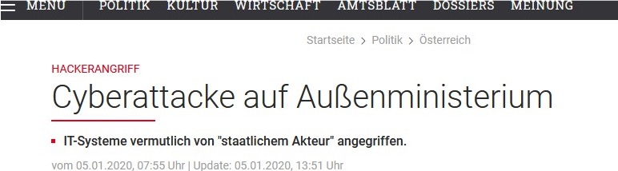
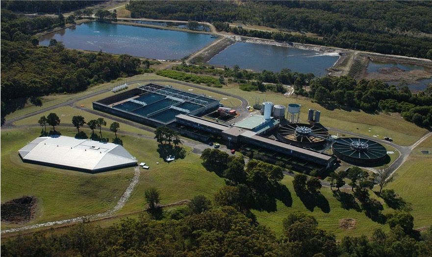
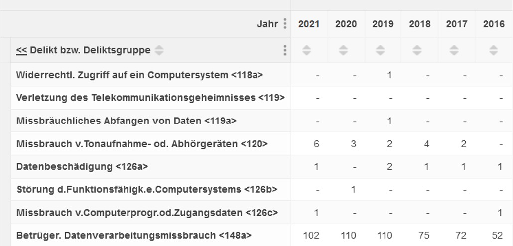

# **Hacking Strafrecht**

*Überblick über die Rechtslage in Österreich und Deutschland*

---

## **Warum?**

Quellen: Wiener Zeitung; heise.de;

---

# UNWISSENHEIT schützt vor Strafe nicht!

---

# **Überblick**

* Grundbegriffe aus dem Strafrecht
* Österreichische Gesetzgebung (StGB)
* Exkurs: deutsche Gesetzgebung (dStGB)
* „Cybersecurity Recht“
Fragen

---

## **Begriffe aus dem Strafrecht**

* **Tatort (§ 62 StGB):**
  * Im **Inland** begangene Taten
  * Ort der Handlung **ODER** Ort des Erfolges
  * Achtung bei Servern & Infrastruktur im Ausland (anderes Recht anwendbar)!

---

## **Begriffe aus dem Strafrecht**

* **Vorsatz (§ 5 Abs 1 StGB):**
  * Subjektive Tatseite
  * Vorstellungen/Gedanken des Täters bei der Tat
  * Die im § beschriebenen Handlungen/Erfolge für möglich halten und mit ihnen abfinden

* **Absicht (§ 5 Abs 2	StGB):**
  * darauf anlegen Handlungen/Erfolge der Norm zu verwirklichen

---

## **Legal Definitionen**

* **Computersystem:** sowohl einzelne als auch verbundene Vorrichtungen, die der automationsunterstützten Datenverarbeitung dienen

* **Daten:** sowohl personenbezogene und nicht personenbezogene Daten als auch Programme

---

## **Legal Definition Kritische Infrastruktur**

* Einrichtungen, Anlagen, Systeme oder Teile mit wesentlicher Bedeutung für die Aufrechterhaltung
  * öffentlichen Sicherheit
  * Landesverteidigung
  * Schutz der Zivilbevölkerung gegen Kriegsgefahren
  * Funktionsfähigkeit öffentlicher Informations- und Kommunikationstechnologie

---

## **Legal Definition Kritische Infrastruktur**

* Einrichtungen, Anlagen, Systeme oder Teile mit wesentlicher Bedeutung für die Aufrechterhaltung
  * Verhütung oder Bekämpfung von Katastrophen
  * öffentlicher Gesundheitsdienst
  * öffentliche Versorgung mit Wasser, Energie sowie lebenswichtigen Gütern
  * öffentliche Abfallentsorgungs- und Kanalwesen
  * öffentlichen Verkehr

---

## **Oldsmar Waterplant Hack**

---

## **Oldsmar Waterplant Hack**

* Wasserwerk in Oldsmar, Florida gehackt
* Hacker wollten über Steuerung große Mengen Ätznatron ins Trinkwasser leiten
* Zugriff mittels TeamViewer und vermutlich gestohlenen Passwörtern
* Schaden konnte durch aufmerksamen Mitarbeiter verhindert werden

---

## **Oldsmar Waterplant Hack**

* Windows 7 auf den Geräten
* Gleiche Passwörter auf allen Geräten
* keine Firewall
* Zugriff über TeamViewer

---

## **Widerrechtlicher Zugriff auf ein Computersystem (§118a StGB)**

Objektive Tatseite („TUN“ des Täters)
* Verschaffung des Zugriffs zu (Teilen) eines fremden Computersystems
* durch Überwindung einer spezifischen Sicherheitsvorkehrung im Computersystem

---

## **Widerrechtlicher Zugriff – Fall 1**

Subjektive Tatseite	(VORSATZ):
* in der Absicht sich oder einem anderen Unbefugten
* Kenntnis von personenbezogenen Daten zu verschaffen
* deren Kenntnis schutzwürdige Geheimhaltungsinteressen des 	Betroffenen verletzt

---

## **Widerrechtlicher Zugriff – Fall 2**

Subjektive Tatseite	(VORSATZ):
* in der Absicht, einem anderen einen Nachteil zuzufügen
* durch die Verwendung von im System gespeicherten und nicht 	für Täter bestimmten Daten
* oder durch die Verwendung des Computersystems

---

## **Besonderheiten**

* Schutzgüter: Privatsphäre, Vermögen, Freiheit, …
* Ermächtigungsdelikt

---

## **Qualifikation**

* „Normaler“ Strafrahmen: Freiheitsstrafe bis zu 6 Monaten
/ Geldstrafe bis zu 360 Tagessätzen
* das Computersystem ist ein wesentlicher Bestandteil der kritischen Infrastruktur: bis zu 2 Jahren Freiheitsstrafe
* im Rahmen einer kriminellen Vereinigung: bis zu 2 Jahren Freiheitsstrafe
* Kritische Infrastruktur + kriminelle Vereinigung:	bis zu 3 Jahren Freiheitsstrafe

---

## **Verletzung des Telekommunikationsgeheimnisses (§ 119 StGB)**

* Anbringen/empfangsbereit machen einer Vorrichtung
* Benützung/Auffangen einer elektromagnetischen Abstrahlung
**Und**
* Absicht (Vorsatz):
  * sich oder unbefugtem Dritten Kenntnis vom Inhalt einer Nachricht
zu verschaffen
  * Nachricht:
    * mittels Telekommunikation/Computersystem übermittelt
    * Nicht für den Täter bestimmt ist

---

## **Missbräuchliches Abfangen von Daten (§ 119a StGB)**

* Benützung einer angebrachten/empfangsbereit machen einer
Vorrichtung
* Auffangen von elektromagnetischer Abstrahlung eines Computersystems
* Absicht:
  * Verschaffung von Kenntnis von nicht für den Täter/ nicht für andere 	bestimmte Daten &
  * Benützung/Zugänglichmachen an andere/Veröffentlichung von Daten
    * Zuwendung eines Vermögensvorteils (Täter oder anderer) oder
    * Zufügung eines Nachteils

---

## **Missbrauch von Tonaufnahmen- oder Abhörgeräte (§ 120 Abs 1 – 2 StGB)**

Abs 1:
* Benützung eines Tonaufnahme- oder Abhörgerätes
* Aufzeichnen/Zugänglichmachen an Unbefugte/Veröffentlichung
* einer nicht für den Täter bestimmten Nachricht 

Abs 2:
* Veröffentlichung /Zugänglichmachen an Dritten (nicht für diesen bestimmt) ohne Einverständnis des Sprechenden
* Einer Tonaufnahme von einer nicht öffentlichen Äußerung

---

## **Missbrauch von Tonaufnahmen- oder Abhörgeräte (§ 120 Abs 2a StGB)**

* Aufzeichnung/Zugänglichmachen an einen Unbefugten/Veröffentlichung
* einer im Telekommunikationsweg übertragenen & nicht für den Täter bestimmten Nachricht
* Absicht:
    * Kenntnisverschaffung vom Inhalt der Nachricht (sich oder anderem 	Unbefugten)

---

## **Datenbeschädigung (§ 126a StGB)**

* Schädigung eines anderen durch
    * Veränderung/Löschung/Unbrauchbarmachen/Unterdrückung von Daten die automationsunterstützt verarbeitet/übermittelt/ überlassen über die der Täter nicht/nicht alleine verfügen darf

---

## **Besonderheiten**

Geschützte Rechtsgüter:
* Vermögen
* Interesse am Fortbestand und der Verfügbarkeit der Daten

 

Im Familienkreis privilegiert

---

## **Qualifikation**

* Normaler Strafrahmen: bis zu 6 Monate/ 360 Tagessätze
* Mehr als 5 000 Euro Schaden: bis zu 2 Jahre Freiheitsstrafe
* Beeinträchtigung vieler Computersysteme unter Verwendung von eigens dafür geschaffenen Mitteln (Computerprogramme, Passwörter, Zugangscodes): bis zu 3 Jahre Freiheitsstrafe

---

## **Qualifikation**

* mehr als 300 000 Euro Schaden oder
* Beeinträchtigung wesentlicher Bestandteile der kritischen Infrastruktur oder
* als Mitglied einer kriminellen Vereinigung
* \>6 Monate bis zu 5 Jahre Freiheitsstrafe

 

**Terroristische Straftat bei Lebensgefahr/großes Schadensausmaß**
(bei Tateignung und entsprechendem Vorsatz)

---

## **Störung der Funktionsfähigkeit eines Computersystems (§ 126b StGB)**

* Schwere Störung durch Dateneingabe/Datenübermittlung eines Computersystems, über das der Täter nicht/nicht alleine verfügen darf
* Nur wenn nicht Datenbeschädigung (§126a StGB) vorliegt Geschütztes Rechtsgut:
  * Ungestörte Verwendbarkeit des Computersystem

---

## **Qualifikation**

* Normaler Strafrahmen: bis zu 6 Monate/ 360 Tagessätze
* längere Zeit andauernde Störung: bis zu 2 Jahre
* Schwere Störung unter Verwendung von eigens dafür geschaffenen Mitteln (Computerprogramme, Passwörter, Zugangscodes): bis zu 3 Jahre

---

## **Qualifikation**

* mehr als 300 000 Euro Schaden

**oder**

* gegen ein Computersystem verübt, das ein wesentlicher Bestandteil der kritischen Infrastruktur ist

**oder**

* als Mitglied einer kriminellen Vereinigung

 

\>6 Monate bis zu 5 Jahre Freiheitsstrafe

---

## **Missbrauch von Computerprogrammen oder Zugangsdaten (§ 126c Abs 1a StGB)**

* Herstellung/Einführung/Vertreibung/Veräußerung/ Zugänglichmachung/ das sich Verschaffen von Computerprogrammen zur Straftatbegehung
* Sich Verschaffen von Zugriffsdaten

 

in Bezug auf betrügerischen Datenmissbrauch (§148a StGB):	Freiheitsstrafe von bis zu zwei Jahren

---

## **Missbrauch von Computerprogrammen oder Zugangsdaten (§ 126c Fall 1 StGB)**

* Herstellung/Einführung/Vertreibung/Veräußerung/ Zugänglichmachung/ das sich Verschaffen
* Computerprogramm/vergleichbarer Vorrichtung
* welche ersichtlich zum Zweck der Begehung von	§§ 118a, 119, 119a, 126a, 126b geschaffen/adaptiert worden ist
* **Vorsatz:** Programm/Vorrichtung zur Begehung der aufgezählten Delikte zu gebrauchen

---

## **Missbrauch von Computerprogrammen oder Zugangsdaten (§ 126c Fall 2 StGB)**

* Herstellung/Einführung/Vertreibung/Veräußerung/ Zugänglichmachen/ sich Verschaffen
* Computerpasswörter, Zugangscodes oder vergleichbarer Daten
  * welche den Zugriff auf ein Computersystem oder einen Teil davon 	ermöglichen
* **Vorsatz:** Zugangsdaten zur Begehung der aufgezählten Delikte von	(§§ 118a, 119, 119a, 126a, 126b StGB) zu gebrauchen
* Strafrahmen: bis zu 6 Monate/ 360 Tagessätze

---

## **Betrügerischer Datenverarbeitungsmissbrauch (§ 148a StGB)**

* Vermögensschädigung eines anderen
* Beeinflussung des Ergebnisses einer automationsunterstützten Datenverarbeitung durch
    * Gestaltung des Programms
    * Eingabe, Veränderung, Löschung oder Unterdrückung von Daten
    * Einwirkung auf den Ablauf des Verarbeitungsvorgangs
* **Vorsatz:** unrechtmäßige Bereicherung

---

## **Ausspähen von Daten eines unbaren Zahlungsmittels (§ 241h StGB)**

* Ausspähung von Daten eines unbaren Zahlungsmittels
* **Vorsatz:**
  * Unrechtmäßige Bereicherung durch Verwendung 
  
    **oder**

  * Fälschung unbarer Zahlungsmittel

---

## **Verurteilungs Statistik**

Quelle: Statistik Austria,	www.statistik.at (21.02.2023)

---

## **Rechtslage Deutschland**

* Strengere Ausgestaltung
* So genannter Hackerparagraf in § 202c dStGB: Vorbereiten des 	Ausspähens und Abfangens von Daten

---

## **Ausspähen von Daten (§ 202a dStGB)**

* Verschaffung des Zugangs zu besonders gesicherten Daten
* Unter Überwindung einer Zugangssicherung 
* Daten
    * nicht für den Täter bestimmt
    * elektronisch, magnetisch oder sonst nicht unmittelbar wahrnehmbar 	gespeichert
* Strafmaß: bis zu 3 Jahre	Freiheitsstrafe/Geldstrafe
* Keine Privatsphäreverletzung/keine Schädigungsabsicht

---

## **Abfangen von Daten (§202b dStGB)**

* Verschaffung von Daten
* aus einer **nichtöffentlichen Datenübermittlung** oder aus der **elektromagnetischen Abstrahlung einer Datenverarbeitungsanlage**
* mit Hilfe von **technischen Mitteln**
* bis zu 2 Jahren Haft/Geldstrafe
* Auffangtatbestand

---

## **Vorbereiten des Ausspähens und Abfangens von Daten (§ 202c dStGB)**

* Vorbereitung von Ausspähen von Daten/Abfangen von Daten
* mittels **Herstellung, Verschaffen, Verkaufen, Überlassen, Verbreiten** oder **sonstiges Zugänglichmachen** von
    * Z 1: Passwörtern oder sonstigen Zugangscodes
    * Z 2: Computerprogrammen, zum Zweck der Begehung von 	Ausspähen von Daten/Abfangen von Daten

---

## **Handlungsempfehlungen**

* keine Weitergabe von Hackertools, Schadprogrammen und ähnlichem
* kein Anstiften zu den oben beschriebenen Vergehen
* die Programme und Tools sollten sicher verwahrt werden
* Verwendung und Anschaffungszweck von diversen Tools änderungsfest dokumentieren
* Bei Sicherheitsüberprüfungen, Penetrationstests etc. die Einwilligung der Verfügungsberechtigten einholen

---

# **DSGVO**
*Datenschutz Grundverordnung*

---

## **DSGVO**

* Schutz personenbezogener Daten
* 25.5.2018
* Sicherheit der Verarbeitung
* Technische und organisatorische Maßnahmen – TOMs
* Datenschutz durch Technikgestaltung und durch datenschutzfreundliche Voreinstellungen

---

## **DSGVO**

Angemessenheit:
* Berücksichtigung des Stands der Technik,
* der Implementierungskosten
* der Art, des Umfangs, der Umstände und der Zwecke der Verarbeitung
* unterschiedlichen Eintrittswahrscheinlichkeit und Schwere Risikos für die Rechte und Freiheiten natürlicher Personen

---

## **DSGVO**

* Pseudonymisierung und Verschlüsselung
* Sicherstellung der dauerhaften Vertraulichkeit, Integrität, Verfügbarkeit und Belastbarkeit der Systeme und Dienste
* Rasche Wiederherstellung Verfügbarkeit der Daten bei einem physischen oder technischen Zwischenfall
* Verfahren zur regelmäßigen Überprüfung, Bewertung und Evaluierung der Wirksamkeit TOMs zur Gewährleistung der Sicherheit der Verarbeitung

---

## **DSGVO**

Meldung Data Breach:
* unverzügliche und möglichst binnen 72 Stunden nachdem ihm 	die Verletzung bekannt wurde
* zuständigen Aufsichtsbehörde
* Dokumentationspflicht

Hohes Risiko:
* Benachrichtigung betroffener Personen

---

# **Artikel 24 DSGVO**

*Verantwortung des Verantwortlichen*

---

## **Verantwortlichkeit und Datenschutzmanagement**

- **Zweck:** Gewährleistung und Nachweis der Einhaltung der DSGVO
- **Maßnahmen:** Implementierung geeigneter technischer und organisatorischer Maßnahmen
- **Risikobasiert:** Berücksichtigung der Art, des Umfangs, der Umstände und der Zwecke der Verarbeitung sowie der Risiken für die Rechte und Freiheiten natürlicher Personen

---

## **Datenschutz durch Technikgestaltung und durch datenschutzfreundliche Voreinstellungen**

- **Artikel 24 (2) DSGVO:** Berücksichtigung des Stands der Technik, der Implementierungskosten, der Art, des Umfangs, der Umstände und der Zwecke der Verarbeitung sowie der unterschiedlichen Eintrittswahrscheinlichkeit und Schwere des Risikos

---

# **Artikel 25 DSGVO**

*Datenschutz durch Technikgestaltung und durch datenschutzfreundliche Voreinstellungen*

---

## **Grundsätze des Datenschutzes durch Technikgestaltung**

- **Ziel:** Einbeziehung des Datenschutzes in die Entwicklung von Geschäftsprozessen für Produkte und Dienstleistungen
- **Umsetzung:** Verwendung von Datenschutz-freundlichen Voreinstellungen

---

## **Datenschutzfreundliche Voreinstellungen**

- **Artikel 25 (2) DSGVO:** Sicherstellung, dass nur personenbezogene Daten verarbeitet werden, die für den jeweiligen spezifischen Zweck notwendig sind
- **Anwendung:** Automatische Einschränkung der Erhebung und Verarbeitung personenbezogener Daten

---

# **Transparenz und Durchsetzung**

*Schlüsselelemente im Datenschutz*

---

## **Transparenz in der Datenverarbeitung**

- **Wichtigkeit:** Klare, verständliche und leicht zugängliche Informationen über Datenverarbeitung
- **Recht auf Information:** Betroffene Personen müssen über die Erhebung und Verwendung ihrer Daten informiert werden

---

## **Durchsetzung der Datenschutzregeln**

- **Aufsichtsbehörden:** Zuständig für die Überwachung und Durchsetzung der DSGVO
- **Sanktionen:** Bußgelder und Strafen bei Nichteinhaltung
- **Rechte der Betroffenen:** Beschwerderecht und Recht auf Schadensersatz

---

# **Hacking Strafrecht**

*Überblick über die Rechtslage in Österreich und Deutschland*