# **Introduction to Binary Exploitation**

Based on the slides, figures, code snippets and previous work of Martin Schwarzl

---

# **Why???**

Many programs are written in memory unsafe languages like C.
-
- Operating system kernels (Linux)
- Browsers (Chromium)
- Runtime environments (JVM)

---

# **Binary Exploitation**
The art of finding vulnerabilities in programs and leveraging them to gain control over the entire program.
-

---

# **Memory safety**
"Memory safety is a concern in software development that aims to avoid software bugs that
cause security vulnerabilities dealing with random-access memory (RAM) access, such as
buffer overflows and dangling pointers."

---

# **Memory safety**
- Can we prevent them?
- Yes Memory safe languages exist, but
    - Huge legacy codebases in C
    - C is often used in the lowest levels of software stacks (OS, drivers, etc.)
    - C is often used in performance-critical code

---

# **Typical memory safety violations**
- Overflows or overreads on memory
- Invalid pointers
    - Null pointer dereferences
- Uninitialized memory access
- Invalid free
    - Use after free

---

# **Types of Memory Safety Violations**
- Spatial memory safety violations
- Temporal memory safety violations

--- 

# **Spatial memory safety violations**
Memory access is out of the object's bounds

- Buffer overflows
- Out of bounds read/write
- Invalid pointer references
    - Null pointer dereferences

---

# **Buffers**
- A buffer is a contiguous memory area
- Buffers are used to store contiguous data (arrays, structs, classes)
- Buffers have boundaries (start address and size)
- Buffer access is often done using simple pointer arithmetic
    - `buffer[i]` is equivalent to `*(buffer + i)`
    - buffer_start + i * sizeof(type)

---
# **Buffers**
- Out-of-bounds access often accesses neighboring buffers

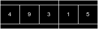

---

# **Buffer overflow**
No bounds checks on adjacent memory areas
```
char buffer[10];
strcpy(buffer, "Hello, World!");
```

---

# **Out of bounds read/write**
Native C arrays do not have bounds checks by default
```
int i = 15;
char buffer[10];
buffer[2] = 3; // CORRECT
buffer[i] = 4; // WRONG 
```
---
# **Invalid pointer references**
```
int *ptr = NULL;
*ptr = 10; // CRASH
```

---

# **Temporal memory safety violations**
Memory access is performed after the object has been freed or before it has been initialized

- Use after free
- Double free
- Use of uninitialized memory

---

# **Use after free**
- Referencing a resource after it was freed
- Often leads to crashes but not always
- Always leads to undefined behavior and unwanted side effects
```
int *ptr = malloc(sizeof(int));
free(ptr);
*ptr = 10; // Undefined behavior
```

---

<!-- footer: "" -->

# **Double free**
- Theoretically easy to detect

```
int *ptr = malloc(sizeof(int));
free(ptr);
free(ptr); // Double free error on most libc implementations
```
- But not always...
```
int *ptr = malloc(sizeof(int));
int *pt2 = malloc(sizeof(int));
free(ptr);
free(ptr2);
free(ptr); // No error but double free
```
---
<!-- footer: "Sebastian Felix, Martin Schwarzl" -->

# **Use of uninitialized memory**
- Who knows what's in there?
```
int x;
if (x == 10) {
    // ...
}
```
- Undefined behavior
- Always initialize your variables!

---

# **Stack**
- Fundamental data structure in computer science
- Last-in, first-out (LIFO) policy
    - Push and pop operations
    - Most recent item is the first to be removed
- Stack is a region of memory
- Each thread has its dedicated stack

---

# **Stack pointer**
- Special-purpose register
- Points to the top of the stack
- Growing downwards on most architectures

--- 

# **Stack operations: PUSH**
- Push: Add an item to the top of the stack
    - Decrease the stack pointer to allocate space for the new item
    - Copy the item to the new top of the stack

---

# **Stack push**

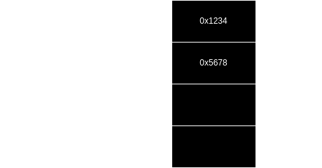

---

# **Stack push**

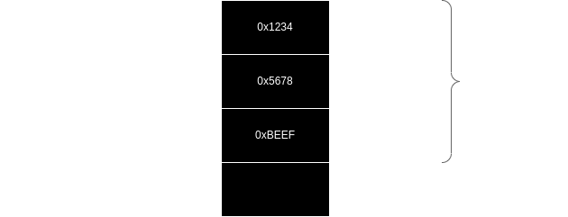

---

# **Stack operations: POP**

- Pop: Remove the top item from the stack
    - Copy the item from the top of the stack to a register
    - Increase the stack pointer to deallocate the space
    - Memory is not erased or zeroed out

---
<!-- footer: "" -->
# **Stack pop**

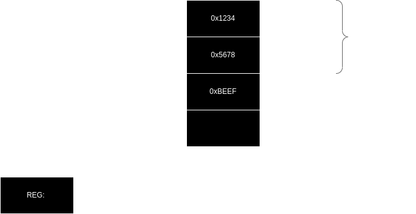

---

# **Stack pop**

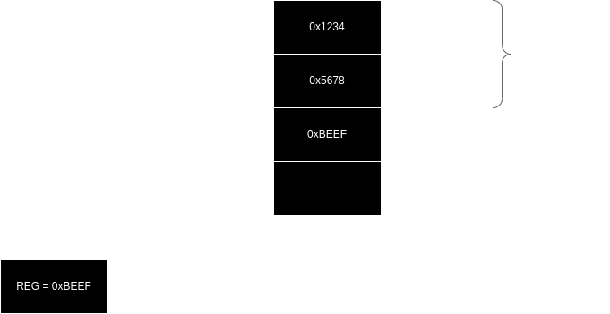

---

<!-- footer: "Sebastian Felix, Martin Schwarzl" -->

# **Callings conventions**
- Specifies how functions are called and how parameters are passed
- Different architectures have different calling conventions
- Different conventions for different purposes
    - System calls
    - User-space functions
    - Library functions

---

# **x86-64 SYSTEM V ABI**
- Most common calling convention on Linux
- Parameters are passed in registers
    - RDI, RSI, RDX, RCX, R8, R9
    - Additional parameters are passed on the stack
- Return value is passed in RAX

---

# **x86-32 calling convention**
- Many different ones:
    - cdecl
    - stdcall
    - fastcall
    - thiscall

---

# **cdecl**
- Common calling convention on x86-32 Unix systems
- Parameters are passed on the stack
    - Last parameter is pushed first (right to left)
- Return value is passed in EAX

---

# **stdcall**
- Common calling convention on x86-32 Windows systems
- Parameters are passed on the stack
    - Last parameter is pushed first (right to left)
- Return value is passed in EAX

---

# **fastcall**
- Parameters are passed in registers
    - ECX, EDX, (and EAX)
    - Additional parameters are passed on the stack
- Return value is passed in EAX

---

# **thiscall**
- Used in C++ for member functions
- Similar to stdcall
- The this pointer is passed in ECX

---

# **Stack frame**
- A stack frame is a region of memory on the stack
- Contains:
    - Return address
    - Stack frame pointer
    - Local variables
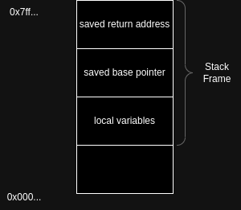
---

# **Stack base pointer**
- Special-purpose register
- Points to the base of the current stack frame
- Used to relatively access local variables and parameters
- The base pointer is saved and restored when calling functions
```c
imul    ecx, dword ptr [ebp + 8] // Get a parameter on the stack
mov     dword ptr [ebp - 4], ecx // Write to a local variable
```
---

# **Calling functions**
- When a function is called, a new stack frame is created
- The stack frame is "destroyed" when the function returns

---

# **Calling functions**
Let's look at an example:
```c
// Function Definition
int foo(int a, int b, int c) {
    return a + b + c;
}
int main() {
    int a = 1, b = 2, c = 3;
    int result = foo(a, b, c); // Function Call
    printf("The sum is: %d\n", result);
    return 0;
}
```

---

# **Calling functions**
The call to `foo` will look like this (cdecl):
```assembly
push c
push b
push a
call foo
```

---

# **Calling functions**
`foo` will now have its own stack frame:
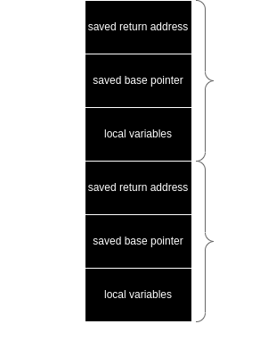

---

# **Calling functions**
How does this work?
- The `call` instruction pushes the return address onto the stack
- The `call` instruction then jumps to the function
- The function then sets up its stack frame
    - Saves the base pointer
    - Allocates space for local variables (adjusts the stack pointer)
- The function then executes

---

# **Returning from functions**
- Whenever a function returns, the stack frame is destroyed
    - The stack frame is destroyed by decreasing the stack pointer
    - The base pointer is restored
- The return value is placed in the appropriate register
- The `ret` instruction pops the return address from the stack and jumps to it

---

# **Returning from functions**
Why do we use the stack?
- Registers are a limited resource
- The stack is a flexible data structure
- The stack is a convenient way to manage function calls
- Allows for recursion/nesting of function calls

---

# **Returning from functions**
Why is this important?

---

# **Stack overflows**
- Local variables are stored on the stack below the base pointer and the return address
- If we write enough data adjacently to a local variable, we can overwrite the return address
- We can then control the flow of the program
---

# **Stack overflows**
Let's look at an example:
```c
void vulnerable_function() {
    char buffer[4];
    gets(buffer); // gets is unsafe and reads until a newline, no bounds checking
    return;
}
int main() {
    vulnerable_function();
    return 0;
}
```

---
Before calling gets, our stack frame looks like this:

```c
void vulnerable_function() {
    char buffer[4];
    gets(buffer); <-
}
int main() {
    vulnerable_function();
    return 0;
}
```
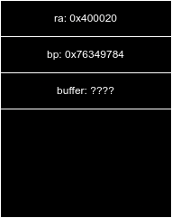

---
After inputting a string longer than 4 characters e.g. "AAAAAAAAAAAA":

```c
void vulnerable_function() {
    char buffer[4];
    gets(buffer);
    return; <-
}
int main() {
    vulnerable_function();
    return 0;
}
```
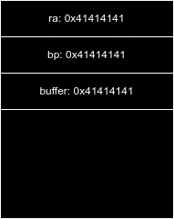

---

# **Stack overflows**
What happens when we input a string longer than 4 characters?
- The buffer overflows
- The return address is overwritten
- Upon returning from `vulnerable_function`, the program will jump to the address we wrote into the buffer
- We can control the flow of the program

---

# **Stack overflows**
- We can control the flow of the program
- What's next?
    - We can jump to shellcode
        - What if the buffer is not executable?
---

# **Stack overflows**
- We can control the flow of the program
- What's next?
    - We can jump to shellcode
    - We can jump to a different part of the program
- => ROP
---

# **Return-oriented programming (ROP)**
- ROP is a technique used to bypass DEP (Data Execution Prevention)
- DEP is a security feature that prevents the execution of code on the stack
    - Every executable page is marked as non-writable
- ROP uses existing code snippets in the process to execute arbitrary code

---

# **Return-oriented programming (ROP)**
- ROP gadgets are short sequences of instructions
    - `pop rdi; ret`
- They end with a `ret` instruction
    - `ret` allows us to jump to the next gadget
    - Chaining gadgets together allows us to execute more complex operations
- Place rop chain on the stack and overwrite the return address
---

# **Return-oriented programming (ROP)**
- Instructions can also be misaligned to forge new instructions
    - `0:  48 c7 c0 89 f8 c3 00  -  mov    rax,0xc3f889`
    - If we now jump to to the 4th byte, we get this:
    - `0:  89 f8 c3  -                mov    eax,edi; ret;`
- Gadgets can also be found in shared libraries
    - libc, etc.
- Given a large enough program or shared libraries, we can find enough gadgets to execute arbitrary code
---

# **Heap**
- The heap is a region of memory used for dynamic memory allocation
    - Managed by the operating system
    - `malloc` is used to allocate memory on the heap
    - `free` is used to deallocate memory

---

# **Heap overflows**
Let's look at an example:
```c
int main() {
    char *buffer = malloc(10);
    ...
    return 0;
}
```
`malloc` allocates 10 bytes of memory on the heap and returns a pointer to it.
What happens if we write more than 10 bytes to `buffer`?

---

# **Heap overflows**

- The heap is a contiguous memory area
- Writing more than 10 bytes to `buffer` will overwrite adjacent memory areas
- What lies beyond `buffer`?
    - Metadata of the heap
    - Other heap allocations
        - Other variables
        - Function pointers (vtables)

---

# **Heap overflows**

- Overwriting heap metadata can lead to arbitrary read/write
- Overwriting function pointers can lead to arbitrary code execution
- Overwriting other variables can alter the program's behavior

- => All of these can lead to arbitrary code execution

---

# **Heap overflows**
Example: What happens if we input a long string?
```c
int main() {
    char *buffer = malloc(10);
    char *other_buffer = malloc(10);
    strcpy(other_buffer, "test.txt");
    fgets(buffer, 100, stdin);
    puts(other_buffer);
    FILE *file = fopen(other_buffer, "r");
    ...
    return 0;
}
```
---

# **Heap overflows**
- We overwrite some of the metadata of the heap
- If we now write even more data, we will eventually overwrite `other_buffer`
- We can control which file is opened

---

# **Use after free**

- What happens if we free a pointer and then use it?
- The memory is not erased or zeroed out
- The memory is still there
- We can still read and write to it
- Those invalid pointers are called "dangling pointers"

---

# **Use after free**
```c
typedef struct {
    void (*func)(char*);
} func_ptr;

int main()
{
    func_ptr* func = malloc(sizeof(func_ptr));
    func->func = puts;
    func->func("Please enter your name");
    free(func);
    char* name = malloc(sizeof(size_t));
    fgets(name, sizeof(size_t), stdin);
    func->func(name);
    ...
```

---

# **Use after free**
We get some memory via malloc:

```
int main()
{
    func_ptr* func = malloc(sizeof(func_ptr)); <-
    func->func = puts;
    func->func("Please enter your name");
    free(func);
    char* name = malloc(sizeof(size_t));
    fgets(name, sizeof(size_t), stdin);
    func->func(name);
    ...
```
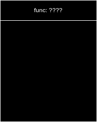

---

# **Use after free**
We write to the memory the function pointer of puts:

```
int main()
{
    func_ptr* func = malloc(sizeof(func_ptr));
    func->func = puts; <-
    func->func("Please enter your name");
    free(func);
    char* name = malloc(sizeof(size_t));
    fgets(name, sizeof(size_t), stdin);
    func->func(name);
    ...
```
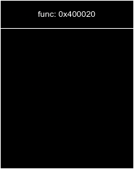

---

# **Use after free**
We free the memory:
```
int main()
{
    func_ptr* func = malloc(sizeof(func_ptr));
    func->func = puts;
    func->func("Please enter your name");
    free(func); <-
    char* name = malloc(sizeof(size_t));
    fgets(name, sizeof(size_t), stdin); 
    func->func(name);
    ...
```
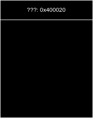

---
<!-- footer: "" -->

# **Use after free**
We allocate new memory for our name:
It is the same memory that was previously used for the function pointer

```
int main()
{
    func_ptr* func = malloc(sizeof(func_ptr));
    func->func = puts;
    func->func("Please enter your name");
    free(func);
    char* name = malloc(sizeof(size_t)); <-
    fgets(name, sizeof(size_t), stdin); 
    func->func(name);
    ...
```
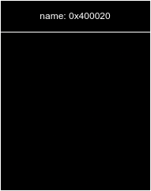

---

<!-- footer: "Sebastian Felix, Martin Schwarzl" -->

# **Use after free**
We effectively write to the memory that was previously used for the function pointer:
```
int main()
{
    func_ptr* func = malloc(sizeof(func_ptr));
    func->func = puts;
    func->func("Please enter your name");
    free(func);
    char* name = malloc(sizeof(size_t));
    fgets(name, sizeof(size_t), stdin); 
    func->func(name); <-
    ...
```
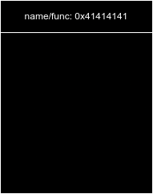

---

# **Use after free**
- Since we never reset the dangling pointer, it still points to the memory we allocated
- malloc will return the same memory after free if the size constraints are met
- We can overwrite new pointers and at the same time overwrite the function pointer

---

# **Format string vulnerabilities**
- Format strings are used to easily format output
    - `printf`, `sprintf`, ...
- The format string can contain format specifiers and converts parameters to strings
    - `%s`, `%d`, `%x`, `%p`, `%n`, `%n` etc.
- Examples:
    - `printf("Hello, %s", "World");`
    - `printf("The %s is: %d", "number", 10);`

---

# **Format string vulnerabilities**
- Format string vulnerabilities occur when:
    - The user can control the format string
    - The format string mismatches with the number of arguments

---

# **Format string vulnerabilities**
- What happens if the user can control the format string?
    - `printf(user_input);`?
    - => Truly arbitrary read/write

---

# **Format string vulnerabilities**
- What happens if we use a format specifier but no argument?
    - `printf("The number is: %d");`
    - It still prints something?!?
    - => Leak data from registers or the stack

---

# **Common defenses**

- Stack canaries
- Data execution prevention (DEP)
- Address space layout randomization (ASLR)

---

# **Stack canaries**
- A random value is placed between the local variables and the return address
- The compiler generates code to check if the canary is still intact before returning from a function
- If the canary is not intact, the program will terminate

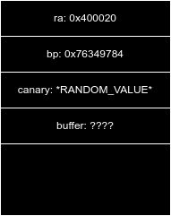

---

# **Stack canaries**
- We can bypass stack canaries if:
    - We can leak the canary e.g. through a format string vulnerability
    - We can brute force the canary
        - May take a long time

---

# **Data execution prevention (DEP)**
- All memory pages that are not explicitly marked as executable are non-executable
- Executable pages are marked as non-writable
- Prevents code execution on the stack and heap
- Prevents modifying executable code pages

---

# **Data execution prevention (DEP)**
- We can bypass DEP if:
    - We can use ROP
    - We can use JIT (Just-In-Time) compilation
    - We can use return-to-libc etc.

---

# **Address space layout randomization (ASLR)**
- Randomizes the base address of the stack, heap, and shared libraries
- Prevents attackers from knowing the exact memory layout
- Makes it harder to exploit memory corruption vulnerabilities

---

# **Address space layout randomization (ASLR)**
- We can bypass ASLR if:
    - We can leak addresses
    - We can brute force addresses
        - May take a long time

---

# **Interested?**
- CTFs (Capture The Flag)
- LosFuzzys @ TU Graz (CTF Team)
    - https://losfuzzys.net/
    - Come to our beginner trainings or play CTFs with us!


---

# **Interested?**
- TU Graz courses:
    - Course Number INP33404UF and INP33503UF | Information Security
        - https://iaik.tugraz.at/is
    - Course Number 705022 and 705023 | Secure Software Development
        - https://iaik.tugraz.at/ssd
    - ... many more on related topics!

---

# **Interested?**
Links and resources:
- https://github.com/shellphish/how2heap
- https://pwnable.kr - Binary exploitation challenges (0 to 100)
- https://pwnable.tw - Binary exploitation challenges (0 to 100)
- https://ropemporium.com/ - ROP challenges
- https://pwnlab.kr/ - More links to even MORE websites :)

---

# **Questions?**