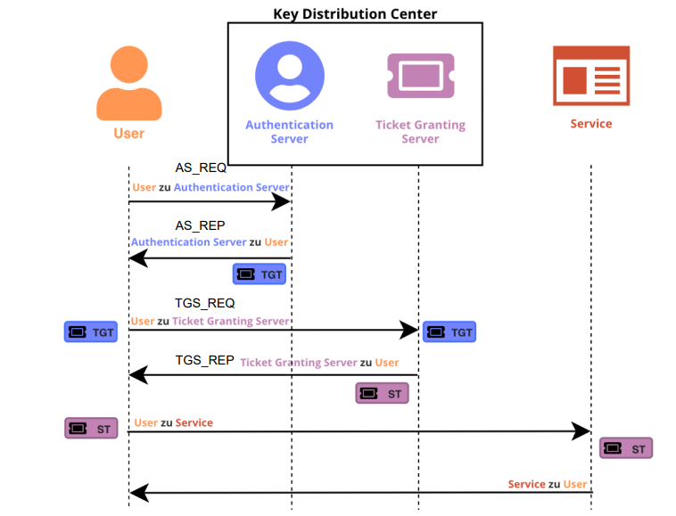
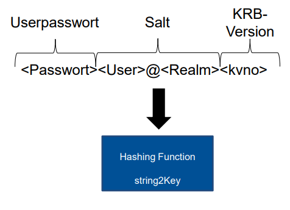

# Windows Penetration Testing

## Impacket

#### Purpose:
Impacket is a versatile Python library specifically designed for interacting with Windows networks, providing low-level access to various network protocols. Its primary purpose within Windows security is to facilitate penetration testing, security auditing, and protocol interaction in Windows environments.

#### Key Capabilities:

1. **Protocol Handling:**
  - Impacket allows for the manipulation and interaction with multiple Windows-specific protocols, including SMB (Server Message Block), MSRPC (Microsoft Remote Procedure Call), DCE-RPC (Distributed Computing Environment - Remote Procedure Call), LDAP (Lightweight Directory Access Protocol), and more.

2. **Credential Manipulation:**
  - It enables the extraction of credentials (passwords, hashes) from Windows systems, aiding in security assessments by demonstrating potential vulnerabilities related to authentication and access control.

3. **Network Communication:**
  - Impacket's classes provide the ability to create and send network packets, analyze their content, and interact with Windows network services. This functionality is crucial for understanding and testing network vulnerabilities.

4. **Exploitation and Testing:**
  - It assists in both identifying vulnerabilities in Windows systems and exploiting these vulnerabilities for security testing purposes. By crafting custom tools and scripts, Impacket aids in demonstrating potential security risks.

5. **Post-Exploitation Actions:**
  - After gaining unauthorized access, Impacket can assist in further actions, such as lateral movement within the network, privilege escalation, and data extraction, showcasing the potential impact of a successful attack.

## Kerberos

#### „Guards the network like Cerberus guards the gates to Hades“

### **1. Kerberos Overview**
Kerberos, named after the mythological three-headed dog, is a distributed authentication system ensuring network security comparable to Cerberus guarding the gates to Hades. It provides robust features:

- **Identity Verification:** Through tickets, it confirms a user's identity, ensuring authenticity.
- **Ticket Expiration:** Limits ticket validity, enhancing security by restricting their lifespan.
- **Forgery Prevention:** Uses cryptographic methods to prevent ticket falsification.
- **No Password Transmission:** Enhances security by avoiding password transmission over the network.
- **Single-Sign-On (SSO):** Allows users to authenticate once and access multiple services without repeated logins.

### **2. Kerberos Applications**
Kerberos finds applications in various systems:

- **Windows Active Directory:** Manages user access and permissions in Windows networks.
- **Cisco Networks:** Crucial for authenticating user access to routers and switches.

### **3. Key Components of Kerberos**

#### **Realms**
- **Definition:** Valid domains where Kerberos authenticates users to services.
- **Functionality:** Allows grouping of systems; multiple realms can interconnect, expanding authentication scope.
- **Realm Name:** Unique and identifiable, often represented as a DNS domain.

#### **Principals**
- **Definition:** Records within the Kerberos Realm Database, representing unique identities within a realm (users or services).
- **Characteristics:** Have one name in a specific format: `<user>/<instance>@<realm>`

#### **Service Principal Names (SPNs)**
- **Purpose:** Every resource in Active Directory requires an SPN, ensuring uniqueness within the environment.
- **Query and Management:** Tools like `setspn.exe` and `ADSIEdit` manage and verify SPNs, preventing conflicts and ensuring seamless resource access.

### **4. Key Distribution Center (KDC) Overview**

#### **Function**
- **Ticket Distribution:** Issues tickets and temporary session keys for user authentication.
- **Key Storage:** Stores symmetric keys for users and services within the Kerberos system.

#### **Components**
- **Authentication Server (AS):** Verifies login requests and issues Ticket-Granting Tickets (TGTs) upon successful authentication.
- **Ticket Granting Server (TGS):** Issues Service Tickets for authenticated users requesting access to services.

### **5. Authentication in Kerberos**

#### **Authenticators**
- **Definition:** Encrypted messages using session keys, authenticating users or services within the Kerberos process.

#### **Tickets**
- **Content:** Contains vital information (User-ID, Service-ID, timestamps) encrypted with the server's secret key.
- **Decryption:** Only the KDC can decrypt and process these tickets.
### **6. Key Usage in Kerberos**

#### **KDC Long-Term Key (Domain-Key)**
- **Purpose:** Encrypts Ticket-Granting Tickets (TGTs), enabling secure communication and validation.

#### **Server/Service Long-Term Key**
- **Purpose:** Encrypts Service Tickets, ensuring secure communication between clients and services.

#### **Client Long-Term Key**
- **Functions:** Used for signing AS-REQ timestamps and session key encryption.

### 7. Overview of Kerberos Vulnerabilities and Mitigation Strategies

#### 1. Golden Tickets:
Golden Tickets are forged Kerberos TGTs (Ticket Granting Tickets) utilized by attackers to exploit Kerberos authentication within a network. These tickets enable an attacker to assume the identity of any user within the domain, possessing full permissions, by bypassing the Key Distribution Center (KDC) entirely.

To generate and utilize a Golden Ticket, an attacker needs specific information:
1. **Domain FQDN (Fully Qualified Domain Name):** This is the complete domain name, such as "example.com."
2. **Domain SID (Security Identifier):** The unique identifier for the domain within the network.
3. **Target User's Username:** The name of the user account the attacker intends to impersonate.
4. **KRBTGT Service Account Password Hash:** This hash allows the attacker to create valid TGTs for arbitrary users without the need for their passwords. The KRBTGT account is a hidden account used by the Key Distribution Center (KDC) in Active Directory for ticket-granting operations.

Once an attacker has obtained this information and successfully crafted a Golden Ticket, they can request a TGS (Ticket Granting Service) for any desired service within the network. This exploitation bypasses the standard authentication process and grants unauthorized access without being detected by typical security measures.

#### 2. Silver Tickets:
Silver Tickets serve as forged TGS (Ticket Granting Service) tickets that adversaries use to exploit Kerberos authentication within a network. Unlike Golden Tickets, Silver Tickets don’t require direct communication with the Key Distribution Center (KDC). Instead, they interact solely with the desired service, allowing attackers to operate more covertly.

Key aspects and steps for utilizing Silver Tickets:
1. **No Direct KDC Interaction:** Unlike Golden Tickets, Silver Tickets do not establish communication with the KDC, making their activity less detectable within the network.
2. **Machine Account Password Requirement:** Attackers need the password of the machine account associated with the targeted service, rather than the KRBTGT hash used in Golden Tickets.
3. **Necessary Domain Information:** Similar to Golden Tickets, obtaining the FQDN and SID of the domain remains essential for crafting Silver Tickets.

Creating a Silver Ticket involves several considerations:
- **Persistence on a Host:** These tickets are valuable for establishing persistence on a specific host within a network, allowing attackers prolonged unauthorized access without detection.
- **Stealthier Approach:** They offer a stealthier method compared to Golden Tickets as they avoid direct communication with the domain controller (DC), reducing the chances of detection.
- **Machine Account Kerberos Key Usage:** The machine account's Kerberos Key, often ending with "$," is crucial for crafting Silver Tickets.
- **Specifying Desired Services:** Attackers need to specify the desired service, such as "cifs/DC2.corp.lab," to gain access or control over that service.
- **Service Requirements:** To acquire a shell or specific access, specifying services like CIFS and/or HOST is often necessary.

#### 2. **Kerberos Vulnerabilities:**

- **Authentication Weaknesses:** Vulnerabilities exist within the Kerberos authentication process, including:
  - Brute-forcing attacks.
  - Ticket manipulation.
  - Kerberoasting attacks aimed at compromising user credentials.

- **Ticket-Based Exploits:** Creation and use of forged Kerberos tickets like Golden Tickets or Silver Tickets, potentially allowing unauthorized access within the Windows domain.

- **Enumeration and Mapping:** Leveraging Kerberos-related information gathered during reconnaissance to map the network infrastructure and identify potential entry points for attacks.

#### 3. **Kerberos Vulnerability Mitigation: Pre-Authentication Enhancement**

- **Problem:** Known usernames can request TGTs from the KDC, leading to offline brute-force attacks on password decryption.

- **Solution:** Enhancing the authentication process by having users include an encrypted timestamp with their password hash in AS_REQ (Authentication Service Request), thereby strengthening security.

- **Mitigation:** Verifying the encrypted timestamp against the user's password hash before issuing the TGT, preventing easy decryption attempts and adding a layer of defense against such attacks.

#### 4. **Additional Kerberos Vulnerabilities:**

- **Service Principal Name (SPN) Enumeration:** Identifying weak SPNs allows attackers to target specific services, exploiting misconfigurations or weaknesses in the service authentication process.

- **AS-REP Roasting:** Exploiting the AS-REP response to extract encrypted Kerberos tickets for offline cracking, potentially compromising user accounts and escalating privileges within the network.

- **KDC Spoofing:** Manipulating KDC responses or impersonating a KDC could allow attackers to intercept or manipulate authentication requests, leading to unauthorized access or information disclosure.

## BloodHound

### What is BloodHound?
BloodHound is a specialized tool designed for analyzing and visualizing the security of Active Directory (AD) environments. It's particularly valuable for security professionals and penetration testers to identify potential attack paths and vulnerabilities within AD infrastructures.

### Core Functionality:
1. **Graph-Based Analysis:** BloodHound uses graph theory to map relationships between various entities in an AD environment, including users, computers, groups, permissions, and more.

2. **Visualization:** It provides a clear, graphical representation of the AD structure and the relationships between different components, offering insights into complex network configurations.

3. **Attack Path Identification:** BloodHound's primary strength lies in uncovering attack paths that could be exploited by attackers. It identifies potential weaknesses, misconfigurations, and overly permissive access controls.

4. **Automated and Manual Analysis:** The tool enables both automated and manual analysis of collected data, allowing security professionals to delve deeper into specific areas of concern.

### Key Capabilities:
1. **Risk Assessment:** BloodHound assesses the risk associated with trust relationships, user permissions, group memberships, and more. It identifies high-risk areas that could be exploited by attackers.

2. **Finding Privilege Escalation Paths:** It helps in identifying paths that could lead to privilege escalation, where an attacker gains higher levels of access beyond their initial compromise.

3. **Credential Theft Paths:** BloodHound can uncover paths through which attackers could steal credentials or gain unauthorized access to sensitive information.

4. **Detecting Overly Permissive Access:** It highlights instances where permissions are excessively granted, potentially exposing the network to security risks.
## Local Privesc

#### 1. Elevated Access and Control:
- **Privilege Elevation:** Exploiting vulnerabilities grants higher privileges than intended, such as moving from a standard user to an administrator.
- **Access to Sensitive Data:** Gain access to confidential files, system settings, and sensitive information due to increased privileges.

#### 2. Persistence and System Compromise:
- **Persistent Access:** Ability to install persistent malware or backdoors, ensuring continued unauthorized access even after initial detection or removal.
- **Complete System Control:** Full control over the system allows manipulation of configurations, software installation, and execution of various commands.

#### 3. Expansion of Attack Capabilities:
- **Escalation for Further Attacks:** Acts as a stepping stone for executing more sophisticated attacks, like remote code execution (RCE) and lateral movement within a network.
- **Leveraging Higher Privileges:** Easier exploitation of other vulnerabilities that are accessible only with escalated privileges.

#### 4. Security and Compliance Risks:
- **Breach of Security Boundaries:** Undermines security measures and access controls, violating the principle of least privilege.
- **Risk of Data Breach:** Increased access to sensitive data heightens the risk of data breaches or unauthorized data exposure.
- **Potential Compliance Violations:** Violates regulatory standards (e.g., GDPR, HIPAA), leading to legal consequences.

#### 5. Impact on Integrity and Recovery:
- **System Integrity Compromised:** Unauthorized system modifications or tampering due to escalated privileges compromise system integrity.
- **Remediation Challenges:** Fixing such vulnerabilities involves complex mitigation strategies, including patching, configuration changes, and updates.
- **Resource-Intensive Recovery:** Restoring affected systems and ensuring they're free from further compromise demands significant time and resources.

#### Consequence Example: Data Breach
- **Scenario:** An attacker gains local admin privileges through an exploit.
- **Consequence:** Access to confidential files and user data.
- **Impact:** Potential data breach, compromising user privacy and possibly leading to regulatory penalties.

Addressing local privilege escalation vulnerabilities is critical for maintaining a secure environment and safeguarding sensitive data from unauthorized access or manipulation.
## Lolbins

#### 1. **Stealth and Evasion:**
- **Legitimate Appearance:** LOLBins leverage built-in Windows tools, appearing as normal system functions, making it harder for security measures to detect their malicious use.
- **Evasion of Security Software:** They bypass security software that typically focuses on detecting known malicious software rather than legitimate system binaries.

#### 2. **Privilege Escalation:**
- **Elevated Permissions:** Certain LOLBins can be exploited to escalate privileges, allowing attackers to gain higher levels of access within the system.

#### 3. **Execution of Arbitrary Code:**
- **Executing Malicious Payloads:** Attackers use LOLBins to run their own scripts or malicious payloads, exploiting the functionalities of these tools for their benefit.

#### 4. **Persistence and Lateral Movement:**
- **Establishing Persistence:** Some LOLBins aid in maintaining access to a compromised system by creating backdoors or establishing persistence mechanisms.
- **Lateral Movement:** They assist attackers in moving laterally within a network by leveraging trusted system tools for unauthorized activities.

### How LOLBins Are Used in Windows Systems:

#### 1. **Common LOLBins:**
- **PowerShell:** Used for scripting and automation, PowerShell can be misused to run malicious scripts or commands.
- **WMIC (Windows Management Instrumentation Command-line):** Allows access to Windows management and can be exploited for various system manipulations.
- **Certutil (Certificate Utility):** Normally used for managing certificates, it can download and decode files from the internet, potentially used for malicious downloads.

#### 2. **Phases of Attack:**
- **Initial Access:** Attackers might use LOLBins during the initial breach to execute code or gain a foothold within the system.
- **Privilege Escalation:** Once inside, they might exploit these tools to escalate privileges and gain higher access levels.
- **Lateral Movement and Persistence:** LOLBins are often utilized to move laterally across the network and maintain access over time.

#### 3. **Detection and Prevention:**
- **Monitoring and Analysis:** Security teams need to monitor system activity, especially the use of these legitimate tools, for suspicious behavior.
- **Restrictions:** Implementing access controls and restrictions on these binaries can mitigate misuse.
- **Behavioral Analysis:** Employing security solutions that analyze the behavior of these tools to detect abnormal or unauthorized activities.
