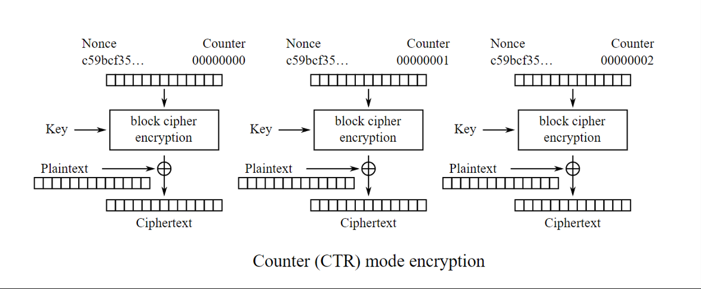
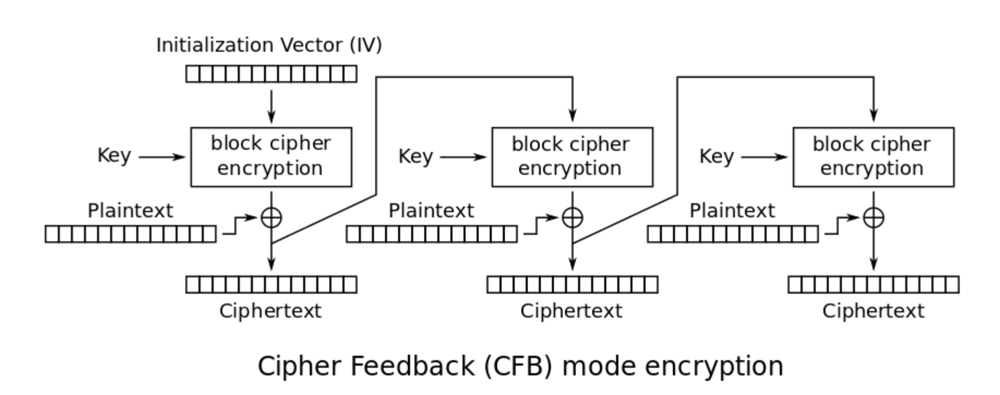

# Symmetric Cryptography

- For symmetric encryption, there exists one single key for encrypting & decrypting data. The key itself can be any arbitrary value.

For instance, let there be Person A (Alice) and Person B (Bob).
Alice wants to send an encrypted message to Alice.
Alice uses the shared key for encrypting the message, whereas Bob uses the same shared key for decrypting the message.
Everyone aware of the shared key can encrypt & decrypt sent messages.

For many block ciphers, an IV (initialization vector) needs to be provided aswell. There's a simple reason for that:
In several ciphers, blocks are depending on each other, meaning block n cannot be en- or decrypted without having block (n-1).
In order to provide a dependency for the very first block, an IV can be used.

In cryptography, there exists a similar concept named NONCE (Number only used once), which is used by ECDSA (Elliptic Curve Digital Signature Algorithm).
Nonces are used for ensuring the uniqueness of cryptographic operations, preventing the reuse of ciphertexts with the same key.
While both of them seem similar, it is important not to confuse an IV (Used for providing randomness for the start of the encryption process) with a NONCE (Ensuring that cryptographic operations can only be performed once).

### Block Ciphers

A block cipher is another kind of algorithm, which encrypts data blockwise instead of one by one. In contrast to stream ciphers, they always operate on blocks of multiple bytes.
Depending on the exact cipher mode, the encrypted data can be either dependend (as it is for CBC) or independent (applies to ECB, which is also why it should not be used, but more on that later) on the previous block. Several block ciphers also make the encrypted data depending on the plaintext,
indicating that data encrypted twice will not look like the same in it's encrypted form.

- Examples:
  - AES - ECB \[Electronic Code Book Mode\]
  - AES - CBC \[Cipher Block Chaining Mode\]
  - Blowfish

### Stream Ciphers

There also exist so-called stream ciphers, which in contrast to block ciphers do not have a fixed blocksize. This means that no padding needs to be applied to the plaintext in order for it to be encrypted.

- Examples:
  - ChaCha20
  - AES (CTR \[Counter Mode\])

## Comparison - Stream Cipher vs Block Cipher

- **Stream Ciphers:**
  - More efficient & faster.
  - Easier to implement.
  - Allows parallel processing.
- **Block Ciphers:**
  - More secure.
  - Harder to derive key from encrypted data.

In the following, you can see the encryption process of a stream cipher (as example, CTR \[Counter-Mode\]) compared to a block cipher (as example, CFB \[AES Cipher Feedback Mode\])

 

## Best Practice

- AES-256
- The longer the key, the better.
- IV should be independent of the key.
- Choose the right mode: (Depends on the usecase. CFB \[Cipher Feedback Mode\], CTR \[Counter-Mode\] are secure & commonly used ones)

A quick overview about modes & their use-cases:

- CTR \[Counter Mode\]: Suitable in cases where parallel processing is a priority, and random access to the ciphertext is required. (Disadvantage: Error propagation is localized to the affected block, meaning a transmission error at a single byte will destroy the entire block)
- CFB \[Cipher Feedback Mode\]: Suitable for applications where real-time processing is essential & a self-synchronizing stream cipher is beneficial. (Disadvantage: CFB may not be as efficient as CTR in scenarios where parallelization is critical. Error propagation is localized to the entire block, same as for CTR)
- CBC \[Cipher Block Chaining Mode\] : A good choice for general-purpose block cipher encryption. (Disadvantage: Processing only possible sequentially, which may impact performance compared to other parallelizable modes.)

ECB counts as insecure, as visible in the following comparison (left=decrypted, middle=ecb, right=cbc).
As each block is encrypted independend of the position & plaintext, each similar datablock consisting of the same bytes results in the same encrypted counterpart when being encrypted, making the encryption pretty ineffective.

  

It is okay to use CBC for data encryption; However, it is discouraged to be used for larger amounts of data, as the encryption pattern starts repeating after a high number of blocks (in fact, after 2^(n/2) blocks, where n is defined as the blocksize).