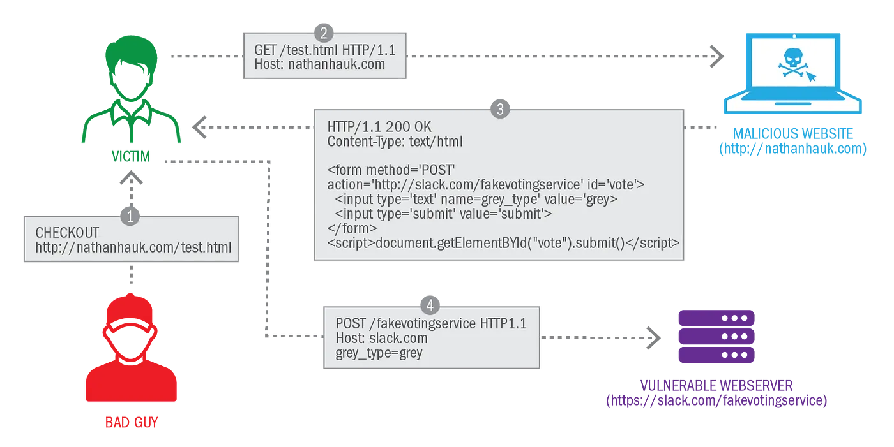

# Client Side Vulnerabilities
## Cross-site Scripting (XSS)
XSS vulnerabilities occur when an application includes untrusted data in new web pages without proper validation or escaping, which can be executed by the web browser.

There are three main types of XSS attacks. These are:

* Reflected XSS, where the malicious script comes from the current HTTP request.

* Stored XSS, where the malicious script comes from the website's database.
  
* DOM-based XSS, where the vulnerability exists in client-side code rather than server-side code.

### Reflected XSS 

The payload is embedded directly into the current HTTP request (often found in URL query parameters) and reflected off the web server. Attackers need to trick users into clicking a link with the malicious payload. Reflected XSS is also sometimes referred to as Non-Persistent or Type-I XSS (the attack is carried out through a single request / response cycle).

Here is a simple example of a reflected XSS vulnerability:

```html
https://insecure-website.com/status?message=All+is+well.

<p>Status: All is well.</p>
```

The application doesn't perform any other processing of the data, so an attacker can easily construct an attack like this:

```html
https://insecure-website.com/status?message=<script>/*+Bad+stuff+here...+*/</script>

<p>Status: <script>/* Bad stuff here... */</script></p>
```

### Stored XSS

The payload is stored on the server (e.g., in a database, logs, etc.) and then later displayed to users. It doesn't require direct interaction by the victim beyond visiting the affected website. Stored XSS is also sometimes referred to as Persistent or Type-II XSS.

The payload in question might be submitted to the application via HTTP requests; for example, comments on a blog post, user nicknames in a chat room, or contact details on a customer order.

Here is a simple example of a stored XSS vulnerability. Suppose a website allows users to submit comments on blog posts, which are displayed to other users. Users submit comments using an HTTP request like the following:

```
POST /post/comment HTTP/1.1
Host: vulnerable-website.com
Content-Length: 100

postId=3&comment=This+post+was+extremely+helpful.&name=Carlos+Montoya&email=carlos%40normal-user.net
```

After this comment has been submitted, any user who visits the blog post will receive the following within the application's response:

```html
<p>This post was extremely helpful.</p>
```

Assuming the application doesn't perform any other processing of the data, an attacker can submit a malicious comment like this:

```html
<script>/* Bad stuff here... */</script>
```

Within the attacker's request, this comment would be URL-encoded as:

```
comment=%3Cscript%3E%2F*%2BBad%2Bstuff%2Bhere...%2B*%2F%3C%2Fscript%3E
```

Any user who visits the blog post will now receive the following within the application's response:

```html
<p><script>/* Bad stuff here... */</script></p>
```

The script supplied by the attacker will then execute in the victim user's browser, in the context of their session with the application.

### DOM-based XSS

The client's Document Object Model (DOM) is manipulated. Here, the payload might be properly handled by the server, but poorly manipulated by client-side scripts leading to the vulnerability.

In the following example, an application uses some JavaScript to read the value from an input field and write that value to an element within the HTML:

```js
var search = document.getElementById('search').value;
var results = document.getElementById('results');
results.innerHTML = 'You searched for: ' + search;
```

If the attacker can control the value of the input field, they can easily construct a malicious value that causes their own script to execute:

```html
You searched for: 
```

In a typical case, the input field would be populated from part of the HTTP request, such as a URL query string parameter, allowing the attacker to deliver an attack using a malicious URL, in the same manner as reflected XSS.

### Impact of XSS vulnerabilities

An attacker who exploits a cross-site scripting vulnerability is typically able to:

* Impersonate or masquerade as the victim user.
* Carry out any action that the user is able to perform.
* Read any data that the user is able to access.
* Capture the user's login credentials.
* Perform virtual defacement of the web site.
* Inject trojan functionality into the web site.

The actual impact of an XSS attack generally depends on the nature of the application, its functionality and data, and the status of the compromised user.

### XSS Mitigation
Preventing cross-site scripting is trivial in some cases but can be much harder depending on the complexity of the application and the ways it handles user-controllable data.

In general, effectively preventing XSS vulnerabilities is likely to involve a combination of the following measures:

* **Filter input on arrival.** At the point where user input is received, filter as strictly as possible based on what is expected or valid input.

* **Encode data on output.** At the point where user-controllable data is output in HTTP responses, encode the output to prevent it from being interpreted as active content. Depending on the output context, this might require applying combinations of HTML, URL, JavaScript, and CSS encoding.

* **Use appropriate response headers.** To prevent XSS in HTTP responses that aren't intended to contain any HTML or JavaScript, you can use the `Content-Type` and `X-Content-Type-Options` headers to ensure that browsers interpret the responses in the way you intend.

* **Content Security Policy.** As a last line of defense, you can use Content Security Policy (CSP) to reduce the severity of any XSS vulnerabilities that still occur.

## Cross-site request forgery (CSRF)

Cross-Site Request Forgery (CSRF) is an attack that abuses the browser’s automatic cookie submission for cross-origin requests to issue state changing requests on the user’s behalf. In other words, the attack is meant to trick users into issuing requests by abusing browser session cookie management.

### How does CSRF work?

For a CSRF attack to be possible, three key conditions must be in place:

* **A relevant action.** There is an action within the application that the attacker has a reason to induce. This might be a privileged action (such as modifying permissions for other users) or any action on user-specific data (such as changing the user's own password).

* **Cookie-based session handling.** Performing the action involves issuing one or more HTTP requests, and the application relies solely on session cookies to identify the user who has made the requests. There is no other mechanism in place for tracking sessions or validating user requests.

* **No unpredictable request parameters.** The requests that perform the action do not contain any parameters whose values the attacker cannot determine or guess. For example, when causing a user to change their password, the function is not vulnerable if an attacker needs to know the value of the existing password.

Here is an example to make things clearer:



1. Here we can see the user issuing a request to view http://nathanhauk.com, a malicious website hosted by the attacker.

2. When the server receives this request, it serves a page that contains a form designated to http://slack.com/fakevotingservice which allows you to vote on your favorite way to spell the word “grey”.

3. When the user receives the response, their browser interprets the HTML and automatically issues the request with the session tokens that belong to that origin. (The browser automatically issues a request with the user’s cookies to the voting service)

4. The server receives the victim’s state changing request, processes it and updates the state on the server accordingly.

> Find another example at: https://portswigger.net/web-security/csrf#how-does-csrf-work

### Defense against CSRF

Nowadays, successfully finding and exploiting CSRF vulnerabilities often involves bypassing anti-CSRF measures deployed by the target website, the victim's browser, or both. The most common defenses you'll encounter are as follows:

#### **CSRF Tokens**: 
- These are unique, secret values generated server-side and shared with the client. When the client performs sensitive actions, such as form submission, the correct CSRF token must be included in the request. This prevents attackers from crafting valid requests on behalf of victims.

#### **SameSite Cookies**: 
- A browser mechanism where cookies are only sent in requests coming from the site that set the cookie. This can prevent attackers from initiating cross-site actions.

- Note: Chrome has enforced Lax SameSite restrictions by default since 2021, with other browsers expected to follow.

#### **Referer-based Validation**: 
- Utilizes the HTTP Referer header to confirm that requests are from the application's domain.

- Limitation: Generally considered less effective than CSRF token validation.

> **Note:** A lot of these countermeasures can potentially bypassed. For mire information see: https://portswigger.net/web-security/csrf/

# Resources
1. https://portswigger.net/web-security/cross-site-scripting
2. https://owasp.org/www-community/attacks/xss/
3. https://portswigger.net/web-security/csrf
4. https://owasp.org/www-community/attacks/csrf
5. https://blog.securityevaluators.com/cracking-javas-rng-for-csrf-ea9cacd231d2