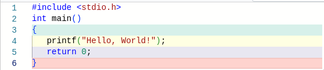
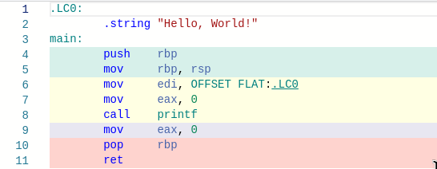
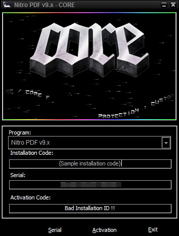

# **Reverse Engineering 101**
As I like to call it:


---

# **Assembly Recap**
CPUs work with registers and memory
x86-64 has many registers such as ` rax, rbx, rcx, rdx, rdi, rsi, rsp, rip, r8-r15`

Special registers:
`rip`: Current instruction pointer
`rsp`: Current stack pointer
`rbp`: Stack frame base pointer
`cr3`: Virtual memory selector for a process

---

# **Assembly Recap**
We can access certain bits of registers individually:


[1]

This allows for backwards compatability
32-bit programs can just use `eax`

---

# **Assembly Recap**
Instruction format:
`<instruction_mnemonic>  <destination>, <source>`
`mov    rax,            rbx`
-> Means move rbx to rax
-> The compiler turns assembly into actual opcodes
`mov    rax,            rbx` => 0x48, 0x89, 0xd8

Online (dis)assembler: https://defuse.ca/online-x86-assembler.htm#disassembly

---

# **Assembly Recap**
## **Data Movement**
`mov rax, rbx` Moves rbx into rax
`mov rax, 0x4000` Moves 0x4000 into rax
`mov rax, [rbx]` Moves the 8-byte value at the address of rbx into rax
=> rbx = 0x400000 `mov rax, [0x400000]`
=> `rax = *0x400000;`

---

# **Assembly Recap**
## **Arithmetics**
`add rax, rbx` Adds rbx to rax
`sub rax, rbx` Substracts rbx from rax
`xor rax, rbx` ...
`and rax, rbx` ...
...


---

# **Assembly Recap**
## **Control Flow**
`call function` Calls a function
`ret` Returns from a function to the next instruction
Example:
`call target`
=> `mov rax, 3`
=> `ret`
`mov rbx, rax` <=
rbx = 3

---

# **Assembly Recap**
## **Control Flow**
`jmp address` Always jump to address

`jnz address` Jump if not zero
`je address` Jump if equal
`jle address` Jump if less or equal
=> Based on EFLAGS (special registers)

---

# **Assembly Recap**
## **Control Flow**
```
cmp rax, rbx
jle error
ret
```

Jump to error IF RAX <= RBX
Otherwise return from the function

---

# **C to assembly**
int x;
x = 10;
`mov rax, 10`


Not every C line is atomic in asm:

x = x + 10;
```
mov rbx, rax // temporary value
add rbx, 10  // add 10
mov rax, rbx // move temp back to x
```

---

# **C to assembly**

C to asm in the browser: https://godbolt.org/#





---

Done by https://defuse.ca/online-x86-assembler.htm#disassembly


---

# **Rev 101**
- Analysis of a system, program or (obfuscated) source code
    - Often binary analysis

- Find out what it’s doing
    - Revertible, Exploitable?

---

# **Real world usage**
- Malware research

- Bug hunting in consumer software & operating systems

- Modding games
    - Cracking

- Debugging


---

# **Executables**

- ELF
    - Executable and Linking Format (UNIX)
- PE
    - Portable Executable (WINDOWS)
- Tells our OS how to load and execute it
- Contains Imports (Libraries), Exports, Sections, Entrypoint
---

# **Tools for executables**
- UNIX:
    - file: Tries to determine the filetype
    - strings: Print all ascii strings in the file
    - hexdump: See raw bytes of the file
    - readelf: Parses the elf file and prints info
    - objdump: ELF infos & disassembly
- Windows:
    - CFF Explorer/ Explorer Suite by NTCore

---

# **Concepts**

- Type of with the binary
    - Static
    - Dynamic
- Emulation/Tracing
- Diffing
- Patching
- Sidechannels
- Symbolic execution
---

# **Static analysis**
- "Offline" analysis
    - Binary is not executed

- Disassembler
    - Turns opcodes into asm instructions
    - `68 6e 2f 73 68` => `push 0x68732f6e`

- Decompiler
    - Turn asm instructions into somewhat readable code

---

# **Static tools**

- Native binaries:
    - Ghidra (Free, works well on most arches + languages)
        - Gui sucks => Cutter Plugin
    - IDA: Gold standard for x86, okayish on other arches
    - BinaryNinja: Mix of IDA and Ghidra
        - Especially good for newer languages such as Go and Rust

---

# **Static tools cont.**

- Python:
    - Pyinstxtractor
        - Extract bundled python files
    - Pycdc
        - Disassemble/Decompile python bytecode

---

# **Static tools cont.**

- Android APKs
    - Essentially Java
    - Jadx: GUI for apktool essentially
    - apktool: CLI to decompile/compile apks
    - github/patrickfav/uber-apk-signer: Automatically sign apks

---

# **Static tools cont.**

- .NET
    - DotPeek: Disassembler/Decompiler for .NET
    - ILSpy: Same as above
    - github/Droppers/SingleFileExtractor: Extract .NET from native libraries

---

# **Dynamic analysis**

- Run/emulate the binary and attach a debugger/tracer
- Breakpoints
    - Addresses in memory where execution shall be paused
        - PAUSE = rip == TARGET
    - Prints infos about current registers/memory
    - Static analysis to find breakpoints
- Single stepping / tracing
    - One instruction at a time, print infos

---

# **Dynamic tools**

- Native:
    - strace/ltrace: Traces syscalls/library calls
    - GDB
        - pwndbg, gef
    - Emulators
        - QEMU
        - qiling
    - Inbuilt debuggers of decompilers
        - Supports breaking in pseudocode

---

# **Dynamic tools cont.**

- Android APKs:
    - Android Studio for emulation
    - FRIDA

- .NET
    - JetBrains RIDER
        - Supports binary debugging
        - Disassembles automatically

---

# **"Just run it lmao" - analysis**

- Running unknown executables
    - **Bad idea**

- Even dockerfiles can be malicious
    - Insomnihack 23 (https://cryptax.github.io/2023/03/25/shame.html)

- Always emulate unknown binaries or use a VM

---

# **"Just run it lmao" - done right**

- Emulation
    - Works cross OS

- Full system emulation
    - Qiling, QEMU System/Usermode

- Instruction emulation
    - **No syscall support**
    - e.g. Unicorn Engine
    - Lots of manual work
---

# **Diffing**

- Prerequisite: Static analysis
- Needs 2+ program databases (e.g. from IDA)
- BinDiff databases
    - Find matching functions/patterns
    - See newly added functions

---


---

# **Patching**
- Modify instructions to get different behaviour
    - e.g. `jnz address` => `jz address`
- Remove instructions by using NOPs
    - `mov eax, ebx` => `nop nop`
- Used to bypass checks or security
- What happens if we leak some infos by doing this?
---

# **Sidechannels**
- Leak infos
- Bruteforce inputs much faster e.g 26*6 instead of 26**6
- Timing attacks
or
- CPU metric attacks
    - perf-tools on Linux

---

# **Symbolic execution**

- Execute a program
- Find all paths and values that satisfy each branching condition
- Output inputs that satisfy certain branches

---
Given this function, how many paths are there?

```
int get_sign(int x) {
  if (x == 0)
    return 0;

  if (x < 0)
    return -1;
  else
    return 1;
}
```

---
Three branching conditions, which inputs satisfy each path?

```
int get_sign(int x) {
  if (x == 0)
    ...
  if (x < 0)
  ...
  if (x > 0)
  ...
}
```


---

# **Symbolic execution tools**
- angr
    - Black box (works on binary level)
- klee
    - White box (requires source code)
- manticore (unmaintained)
    - Like angr black box, requires more fine tuning
---

# **How2Start**
1. Run strings and gather infos about the binary
2. What's the goal?
    - Want a key/input?
    - Optimization problem?
3. Optional: Can we cheese it?
    - Sidechannels? Do we have an oracle?
    - Symbolic execution
    - Patching or info leaks?

---

# **How2Start cont.**
4. *Actually* reverse the binary and figure out the *actual* solution
5. ???
6. Validate solution

---


# **Live demo - cracking**
---

## References

https://ike.mahaloz.re/
https://godbolt.org/
https://dogbolt.org/
https://defuse.ca/online-x86-assembler.htm#disassembly
https://ctf101.org/

[1]: https://ctf101.org/reverse-engineering/what-is-assembly-machine-code/